# ForehApp Store — Modelo Entidad-Relación

```mermaid
erDiagram

    %% ═══════════════════════════════════════
    %%  USERS & AUTH
    %% ═══════════════════════════════════════

    users {
        bigint user_id PK
        varchar email
        varchar password
        varchar name
        varchar lastname
        int user_status
        datetime creation_date
        varchar allow_notification
    }

    roles {
        bigint role_id PK
        varchar name
    }

    user_roles {
        bigint user_id FK
        bigint role_id FK
    }

    store_profiles {
        bigint store_profile_id PK
        bigint user_id FK
        varchar phone
        int loyalty_points
        boolean active
    }

    store_profile_roles {
        bigint store_profile_id FK
        varchar role
    }

    store_profile_addresses {
        bigint address_id PK
        bigint store_profile_id FK
        varchar alias
        varchar street
        varchar city
        varchar state
        varchar country
        varchar zip_code
        boolean is_default
    }

    store_confirmation_token {
        bigint id PK
        bigint user_id FK
        varchar token
        datetime created_at
        datetime expires_at
        datetime confirmed_at
    }

    %% ═══════════════════════════════════════
    %%  CATALOG
    %% ═══════════════════════════════════════

    store_brands {
        bigint brand_id PK
        varchar description
    }

    store_categories {
        bigint category_id PK
        varchar description
    }

    store_lines {
        bigint line_id PK
        bigint brand_id FK
        bigint category_id FK
        varchar description
    }

    store_attributes {
        bigint attribute_id PK
        varchar description
    }

    store_attribute_values {
        bigint attribute_value_id PK
        bigint attribute_id FK
        varchar description
    }

    store_category_attributes {
        bigint category_attribute_id PK
        bigint category_id FK
        bigint attribute_id FK
        varchar required
    }

    %% ═══════════════════════════════════════
    %%  PRODUCTS
    %% ═══════════════════════════════════════

    store_products {
        bigint product_id PK
        bigint seller_id FK
        bigint brand_id FK
        bigint line_id FK
        bigint category_id FK
        varchar title
        text description
        varchar status
        datetime created_at
    }

    store_product_variants {
        bigint variant_id PK
        bigint product_id FK
        varchar sku
        decimal price
        decimal compare_at_price
        int stock
        datetime created_at
    }

    store_product_variant_attribute_values {
        bigint variant_id FK
        bigint attribute_value_id FK
    }

    store_product_images {
        bigint id PK
        bigint product_id FK
        varchar s3_key
        varchar url
        int display_order
        datetime created_at
    }

    store_inventory_movements {
        bigint id PK
        bigint variant_id FK
        int quantity
        varchar reason
        datetime created_at
    }

    %% ═══════════════════════════════════════
    %%  CART & WISHLIST
    %% ═══════════════════════════════════════

    store_carts {
        bigint cart_id PK
        bigint store_profile_id FK
        varchar status
        datetime creation_date
        datetime updated_at
    }

    store_cart_items {
        bigint cart_item_id PK
        bigint cart_id FK
        bigint variant_id FK
        int quantity
        decimal price_at_add
        datetime added_date
    }

    store_wishlists {
        bigint wishlist_id PK
        bigint store_profile_id FK
        datetime created_at
    }

    store_wishlist_items {
        bigint wishlist_item_id PK
        bigint wishlist_id FK
        bigint product_id FK
        datetime added_at
    }

    %% ═══════════════════════════════════════
    %%  ORDERS
    %% ═══════════════════════════════════════

    store_orders {
        bigint order_id PK
        bigint buyer_id FK
        varchar status
        decimal total
        varchar shipping_address
        varchar shipping_city
        varchar shipping_country
        datetime created_at
    }

    store_order_seller_groups {
        bigint group_id PK
        bigint order_id FK
        bigint seller_id FK
        varchar status
        decimal subtotal
        varchar tracking_number
        datetime prepared_at
        datetime shipped_at
        datetime delivered_at
        datetime cancelled_at
        varchar cancellation_reason
    }

    store_order_items {
        bigint item_id PK
        bigint group_id FK
        bigint variant_id FK
        int quantity
        decimal unit_price
    }

    %% ═══════════════════════════════════════
    %%  PAYMENT & SHIPPING
    %% ═══════════════════════════════════════

    payments {
        bigint payment_id PK
        bigint order_id FK
        varchar method
        varchar status
        decimal amount
        datetime payment_date
        varchar reference
    }

    shipments {
        bigint shipment_id PK
        bigint order_id FK
        varchar address
        varchar city
        varchar country
        varchar shipment_status
        date ship_date
        date delivery_date
    }

    %% ═══════════════════════════════════════
    %%  RETURNS & REVIEWS
    %% ═══════════════════════════════════════

    store_return_requests {
        bigint return_id PK
        bigint group_id FK
        bigint buyer_id FK
        varchar return_type
        varchar reason
        decimal refund_amount
        varchar admin_notes
        varchar status
        datetime created_at
        datetime updated_at
    }

    store_return_items {
        bigint return_item_id PK
        bigint return_id FK
        bigint order_item_id FK
        int quantity_to_return
    }

    store_product_reviews {
        bigint review_id PK
        bigint product_id FK
        bigint store_profile_id FK
        int rating
        varchar title
        text comment
        varchar status
        datetime created_at
        datetime updated_at
    }

    %% ═══════════════════════════════════════
    %%  PROMOTIONS
    %% ═══════════════════════════════════════

    store_coupons {
        bigint coupon_id PK
        bigint seller_id FK
        varchar code
        varchar discount_type
        decimal discount_value
        decimal min_order_amount
        int max_uses
        int uses_count
        int max_uses_per_user
        date valid_from
        date valid_until
        varchar status
        datetime created_at
    }

    store_coupon_redemptions {
        bigint redemption_id PK
        bigint coupon_id FK
        bigint store_profile_id FK
        bigint order_id
        decimal discount_applied
        datetime used_at
    }

    discounts {
        bigint discount_id PK
        varchar description
        varchar type
        decimal value
        date start_date
        date end_date
    }

    user_discounts {
        bigint user_discount_id PK
        bigint user_id FK
        bigint discount_id FK
    }

    %% ═══════════════════════════════════════
    %%  GROUPS
    %% ═══════════════════════════════════════

    product_groups {
        bigint group_id PK
        varchar name
        varchar type
        decimal discount
    }

    product_group_details {
        bigint group_detail_id PK
        bigint group_id FK
        bigint product_id FK
    }

    %% ═══════════════════════════════════════
    %%  SUPPLIERS
    %% ═══════════════════════════════════════

    suppliers {
        bigint supplier_id PK
        varchar business_name
        varchar tax_id
        varchar contact_name
        varchar phone
        varchar email
        varchar address
        varchar city
        varchar country
        date registration_date
        varchar status
    }

    product_suppliers {
        bigint product_supplier_id PK
        bigint product_id FK
        bigint supplier_id FK
        int available_quantity
        int blocked_quantity
        int sold_quantity
        int version
    }

    product_attribute_values {
        bigint product_attribute_id PK
        bigint product_supplier_id FK
        bigint attribute_value_id FK
    }

    product_prices {
        bigint price_id PK
        bigint product_supplier_id FK
        decimal price
        date start_date
        date end_date
    }

    %% ═══════════════════════════════════════
    %%  NOTIFICATIONS
    %% ═══════════════════════════════════════

    store_fcm_tokens {
        bigint id PK
        bigint user_id
        varchar token
        boolean active
        datetime created_at
        datetime updated_at
    }

    store_push_subscriptions {
        bigint id PK
        bigint user_id
        varchar endpoint
        varchar p256dh
        varchar auth
        bigint expiration_time
        boolean active
        datetime created_at
        datetime updated_at
    }

    %% ═══════════════════════════════════════
    %%  RELATIONSHIPS
    %% ═══════════════════════════════════════

    %% Auth & Users
    users                           ||--||    store_profiles                    : "has profile"
    users                           }o--o{    roles                             : "user_roles"
    users                           ||--o{    store_confirmation_token          : "confirms"
    store_profiles                  ||--o{    store_profile_addresses           : "has"
    store_profiles                  ||--o{    store_profile_roles               : "has"

    %% Catalog
    store_brands                    ||--o{    store_lines                       : "has"
    store_categories                ||--o{    store_lines                       : "has"
    store_categories                ||--o{    store_category_attributes         : "defines"
    store_attributes                ||--o{    store_category_attributes         : "belongs to"
    store_attributes                ||--o{    store_attribute_values            : "has values"

    %% Products
    store_profiles                  ||--o{    store_products                    : "sells"
    store_brands                    ||--o{    store_products                    : "classifies"
    store_lines                     |o--o{    store_products                    : "groups"
    store_categories                ||--o{    store_products                    : "classifies"
    store_products                  ||--o{    store_product_variants            : "has"
    store_products                  ||--o{    store_product_images              : "has"
    store_product_variants          }o--o{    store_attribute_values            : "variant_attrs"
    store_product_variants          ||--o{    store_inventory_movements         : "tracks"

    %% Cart
    store_profiles                  ||--o{    store_carts                       : "owns"
    store_carts                     ||--o{    store_cart_items                  : "contains"
    store_product_variants          ||--o{    store_cart_items                  : "in cart"

    %% Wishlist
    store_profiles                  ||--o|    store_wishlists                   : "has"
    store_wishlists                 ||--o{    store_wishlist_items              : "contains"
    store_products                  ||--o{    store_wishlist_items              : "in wishlist"

    %% Orders
    store_profiles                  ||--o{    store_orders                      : "places"
    store_orders                    ||--o{    store_order_seller_groups         : "split by seller"
    store_profiles                  ||--o{    store_order_seller_groups         : "fulfills"
    store_order_seller_groups       ||--o{    store_order_items                 : "contains"
    store_product_variants          ||--o{    store_order_items                 : "ordered"

    %% Payment & Shipping
    store_orders                    ||--o{    payments                          : "paid by"
    store_orders                    ||--o{    shipments                         : "shipped by"

    %% Returns
    store_order_seller_groups       ||--o|    store_return_requests             : "returned"
    store_profiles                  ||--o{    store_return_requests             : "requests"
    store_return_requests           ||--o{    store_return_items                : "includes"
    store_order_items               ||--o{    store_return_items                : "returned"

    %% Reviews
    store_products                  ||--o{    store_product_reviews             : "reviewed by"
    store_profiles                  ||--o{    store_product_reviews             : "writes"

    %% Promotions
    store_profiles                  ||--o{    store_coupons                     : "creates"
    store_coupons                   ||--o{    store_coupon_redemptions          : "redeemed in"
    store_profiles                  ||--o{    store_coupon_redemptions          : "uses"
    users                           ||--o{    user_discounts                    : "has"
    discounts                       ||--o{    user_discounts                    : "applied to"

    %% Groups
    product_groups                  ||--o{    product_group_details             : "contains"
    store_products                  ||--o{    product_group_details             : "belongs to"

    %% Suppliers
    suppliers                       ||--o{    product_suppliers                 : "supplies"
    store_products                  ||--o{    product_suppliers                 : "supplied by"
    product_suppliers               ||--o{    product_attribute_values          : "has attrs"
    store_attribute_values          ||--o{    product_attribute_values          : "used in"
    product_suppliers               ||--o{    product_prices                    : "has prices"
```

## Tablas no implementadas (stub vacío)
| Entidad | Tabla esperada | Estado |
|---------|---------------|--------|
| Subcategory | — | Clase vacía, sin implementar |
| Stock | — | Clase vacía, sin implementar |
| StockMovement | — | Clase vacía, sin implementar |
| Promotion | — | Clase vacía, sin implementar |
| ShippingAddress | — | Clase vacía, sin implementar |

## Resumen por módulo
| Módulo | Tablas |
|--------|--------|
| userModule | users, roles, user_roles, store_profiles, store_profile_roles, store_profile_addresses |
| authModule | store_confirmation_token |
| productModule | store_brands, store_categories, store_lines, store_attributes, store_attribute_values, store_category_attributes, store_products, store_product_variants, store_product_variant_attribute_values, store_product_images, store_inventory_movements |
| cartModule | store_carts, store_cart_items |
| wishlistModule | store_wishlists, store_wishlist_items |
| orderModule | store_orders, store_order_seller_groups, store_order_items |
| paymentModule | payments |
| shippingModule | shipments |
| returnModule | store_return_requests, store_return_items |
| reviewModule | store_product_reviews |
| promotionModule | store_coupons, store_coupon_redemptions, discounts, user_discounts |
| groupModule | product_groups, product_group_details |
| supplierModule | suppliers, product_suppliers, product_attribute_values, product_prices |
| notificationModule | store_fcm_tokens, store_push_subscriptions |
| inventoryModule | *(sin implementar)* |
